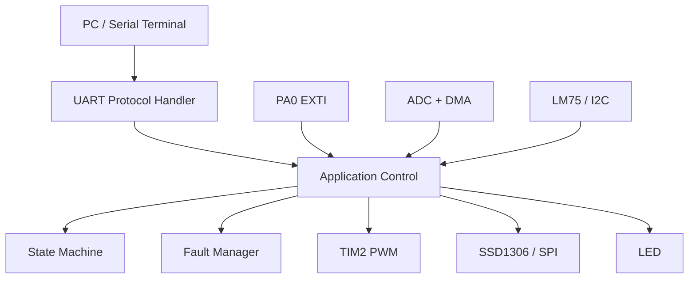
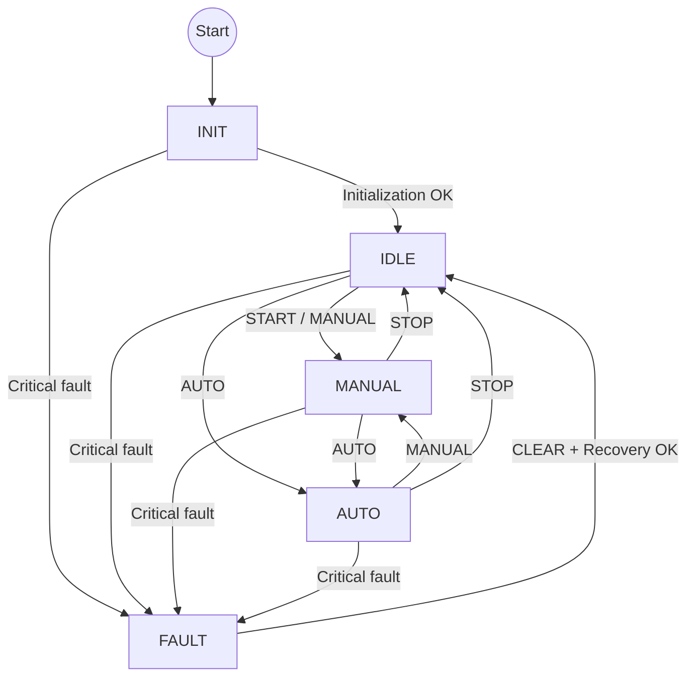
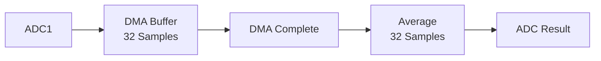
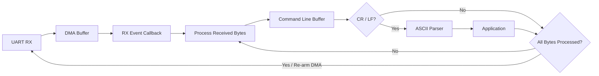
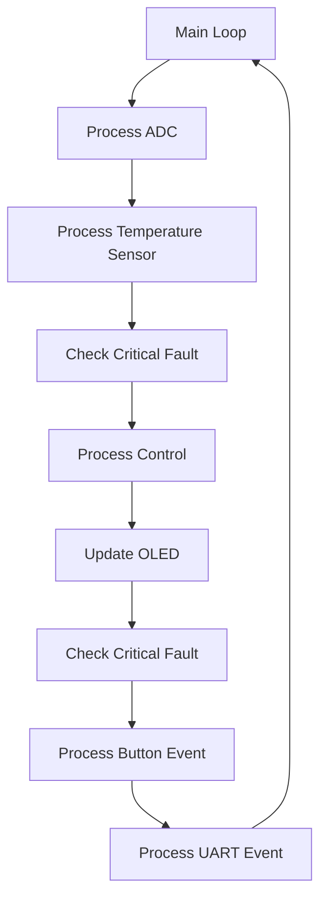
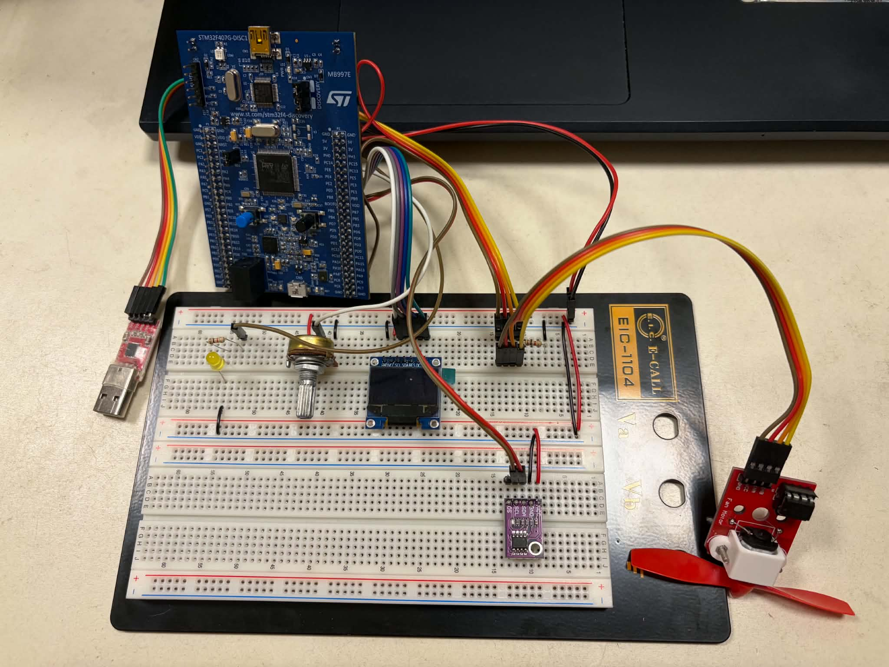
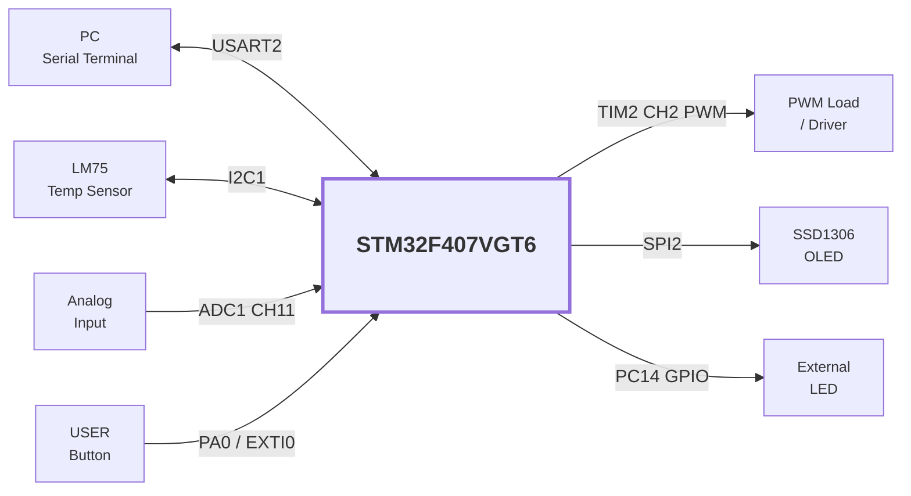

<div align="center">

# STM32F407 Smart Controller

### Multi-Peripheral Embedded Control System

**STM32F407VGT6 · C · STM32 HAL · DMA · UART · I2C · SPI · PWM · EXTI**

A modular embedded firmware project integrating sensor acquisition,  
command control, automatic PWM regulation, OLED monitoring,  
state management, and fault handling.

</div>

---

## Overview

This project implements a complete embedded control system on the
**STM32F407VGT6**.

Instead of demonstrating peripherals independently, the project integrates
multiple STM32 peripherals into a single application with a structured
firmware architecture.

### Highlights

- ADC continuous sampling with **DMA**
- UART command interface using **DMA + IDLE detection**
- LM75 temperature sensing through **I2C**
- SSD1306 OLED display through **SPI**
- Hardware PWM generation with **TIM2**
- USER button input using **EXTI**
- `INIT / IDLE / MANUAL / AUTO / FAULT` state machine
- Centralized fault manager
- Automatic fail-safe PWM shutdown
- Human-readable ASCII command interface
- Modular `.c / .h` firmware structure

---

## System Architecture



---

## Operating Modes

| Mode | Description |
|---|---|
| `INIT` | System initialization |
| `IDLE` | System ready, PWM output disabled |
| `MANUAL` | PWM controlled through UART |
| `AUTO` | PWM automatically controlled by temperature |
| `FAULT` | Critical fault state, PWM forced to 0% |

### State Flow



---

## Automatic PWM Control

In `AUTO` mode, PWM duty cycle is calculated according to the LM75
temperature measurement.

| Temperature | PWM |
|---|---:|
| ≤ 25 °C | 0% |
| 32.5 °C | 50% |
| ≥ 40 °C | 100% |

For temperatures between 25 °C and 40 °C:

```text
PWM (%) = (Temperature - 25) × 100 / (40 - 25)
```

This creates a simple linear temperature-control profile.

---

## UART Command Interface

USART2 provides a human-readable command interface.

### Configuration

```text
Baud Rate : 115200
Data Bits : 8
Stop Bits : 1
Parity    : None
Flow Ctrl : None
RX Method : DMA + UART IDLE
```

### Commands

| Command | Description |
|---|---|
| `PING` | Communication test |
| `START` | Enter MANUAL mode |
| `STOP` | Return to IDLE and stop PWM |
| `MANUAL` | Enter MANUAL mode |
| `AUTO` | Enter AUTO mode |
| `PWM <0-100>` | Set PWM duty |
| `STATUS` | Read system status |
| `TEMP` | Read temperature |
| `ADC` | Read ADC value |
| `CLEAR` | Clear fault and attempt recovery |
| `LED ON` | Turn LED on |
| `LED OFF` | Turn LED off |
| `LED TOGGLE` | Toggle LED |

### Example

```text
> PING
PONG

> MANUAL
OK MODE=MANUAL

> PWM 50
OK PWM=50

> STATUS
MODE=MANUAL TEMP=25.5C ADC=2048 PWM=50 FAULT=0x0000
```

---

## Peripheral Integration

| Peripheral | Configuration | Function |
|---|---|---|
| ADC1 | 12-bit + DMA | Analog signal acquisition |
| DMA2 | Circular transfer | ADC sample buffering |
| USART2 | 115200 + DMA | Command interface |
| I2C1 | 100 kHz | LM75 temperature sensor |
| SPI2 | Master | SSD1306 OLED |
| TIM2 CH2 | ~1 kHz | PWM generation |
| EXTI0 | Rising edge | USER button |
| GPIO PC14 | Output | External LED |

---

## ADC + DMA

ADC1 continuously samples an analog input.

A DMA buffer stores:

```text
32 samples
```

After 32 ADC samples are transferred by DMA, the DMA completion callback signals the main loop to calculate the average.



Raw ADC range:

```text
0 ~ 4095
```

The driver also provides voltage conversion:

```text
Voltage (mV) = ADC × 3300 / 4095
```

---

## UART DMA Reception

UART reception uses DMA together with UART IDLE detection. Received data is
accumulated in a line buffer until a CR (`\r`) or LF (`\n`) terminator is detected.



This avoids continuously polling the UART peripheral while supporting
variable-length ASCII commands.

---

## Fault Management

The firmware uses a centralized fault bitmask.

Current fault conditions include:

| Fault | Critical |
|---|---|
| Temperature sensor communication failure | Yes |
| Invalid UART command | No |
| Invalid parameter | No |

A critical temperature sensor failure triggers:


This provides a basic fail-safe mechanism.

### Recovery

The user can issue:

```text
CLEAR
```

The firmware clears the fault flags and re-checks the temperature sensor.

If the sensor responds correctly:

```text
FAULT → IDLE
```

Otherwise the controller remains in the fault condition.

---

## OLED Monitoring

The SSD1306 OLED displays system information in real time.

Example:

```text
MODE: MANUAL
TEMP: 25.5C
ADC : 2048
PWM : 50%
FAULT: NONE
```

SPI2 is used for OLED communication.

Control pins:

| Signal | Pin |
|---|---|
| CS | PE7 |
| DC | PE8 |
| RESET | PE9 |

---

## Hardware Overview

### MCU

**STM32F407VGT6**

Clock configuration:

```text
SYSCLK : 168 MHz
HCLK   : 168 MHz
PCLK1  : 42 MHz
PCLK2  : 84 MHz
```

### Main Components

- STM32F407VGT6 development board
- LM75 temperature sensor
- SSD1306 SPI OLED
- Analog input / potentiometer
- External LED
- ST-LINK debugger
- USB-UART adapter
- Breadboard and jumper wires

---

## Software Structure

```text
Core/
├── Inc/
│   ├── analog_input.h
│   ├── fault_manager.h
│   ├── oled.h
│   ├── protocol.h
│   ├── pwm.h
│   ├── system_state.h
│   └── temperature_sensor.h
│
└── Src/
    ├── analog_input.c
    ├── fault_manager.c
    ├── main.c
    ├── oled.c
    ├── protocol.c
    ├── pwm.c
    ├── system_state.c
    └── temperature_sensor.c
```

### Module Responsibilities

| Module | Responsibility |
|---|---|
| `analog_input` | ADC DMA acquisition and averaging |
| `temperature_sensor` | LM75 I2C communication |
| `pwm` | PWM generation and duty control |
| `oled` | SSD1306 display driver |
| `protocol` | UART ASCII command parser |
| `system_state` | State transition management |
| `fault_manager` | Fault detection and storage |
| `main` | Application scheduling and coordination |

---

## Firmware Architecture



DMA and interrupts handle asynchronous peripheral events, while application
logic remains primarily in the main loop.

---

## Design Principles

### Keep Interrupts Lightweight

Interrupt callbacks mainly set flags:

```c
button_event = 1;
```

The main loop performs the actual application processing.

This keeps interrupt execution short and predictable.

### Separate Drivers from Application Logic

Peripheral-specific logic is separated into dedicated modules instead of
placing everything inside `main.c`.

### Fail-Safe Output

Critical faults force:

```text
PWM = 0%
```

to prevent the actuator from continuing to operate when sensor feedback is
unavailable.

### Integer-Based Temperature

Temperature is stored internally as:

```text
Celsius × 10
```

Example:

```text
25.5 °C → 255
```

This allows control calculations without requiring floating-point arithmetic.

---

## Build

### Requirements

- STM32CubeIDE
- STM32 HAL
- ST-LINK

Clone the repository:

```bash
git clone https://github.com/John0729/STM32F407-Smart-Controller.git
```

Import into STM32CubeIDE:

```text
File
→ Import
→ General
→ Existing Projects into Workspace
```

Then:

```text
Build Project
→ Connect ST-LINK
→ Run / Debug
```

The CubeMX hardware configuration is stored in:

```text
STM32F407VGT6_Smart_Controller.ioc
```

---

## Demo

### Suggested Test Flow

```text
1. PING
2. STATUS
3. MANUAL
4. PWM 25
5. PWM 50
6. PWM 100
7. ADC
8. TEMP
9. AUTO
10. Disconnect LM75
11. STATUS
12. Reconnect LM75
13. CLEAR
```

### Hardware Setup





---

## Skills Demonstrated

This project demonstrates practical experience with:

`STM32` · `Embedded C` · `HAL` · `GPIO` · `EXTI` · `ADC` · `DMA`  
`UART` · `I2C` · `SPI` · `PWM` · `Timers` · `State Machine`  
`Fault Handling` · `Serial Protocol` · `Git`

---

